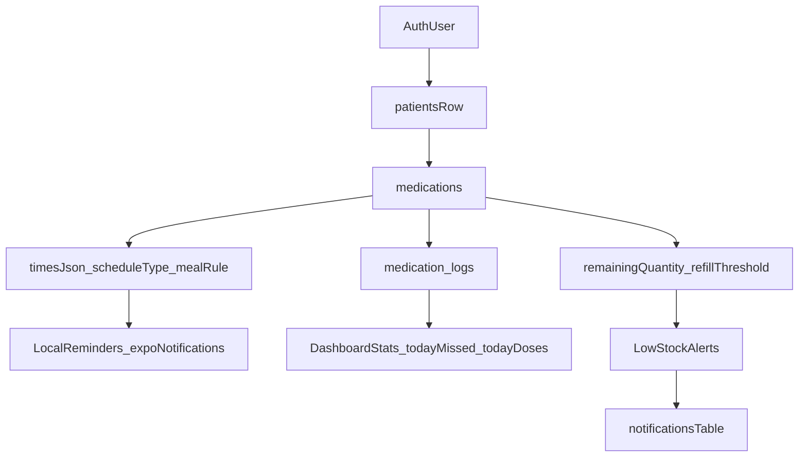

## 1) Audit current Medications screen

### What exists now
- **Screen**: [`src/screens/MedicationsScreen.tsx`](src/screens/MedicationsScreen.tsx)
  - Header + a toggled **inline add form** and a **basic list** of rows.
  - Add flow hardcodes `time_of_day: ['morning']` and only stores `name/dosage/frequency/instructions/is_active`.
- **Service**: [`src/services/medication.service.ts`](src/services/medication.service.ts)
  - Only `getMedications(patientId)`, `addMedication`, `updateMedication` with a minimal `Medication` type.
- **Database**: [`supabase/migrations/20260420_init.sql`](supabase/migrations/20260420_init.sql)
  - `public.medications` table only has: `dosage`, `frequency`, `time_of_day text[]`, `start_date`, `end_date`, `instructions`, `is_active`, `created_at`.
  - RLS exists, but it’s the same simple “patient belongs to auth user” pattern (good baseline).
- **RTL + theme**:
  - RTL is enabled globally via `I18nManager` in `App.tsx` (restart required).
  - Theme exposes `isRTL` in [`src/theme/useTheme.ts`](src/theme/useTheme.ts).
  - `ScreenHeader` is LTR-ish (back chevron always `chevron-back`, title centered) in [`src/components/ui/ScreenHeader.tsx`](src/components/ui/ScreenHeader.tsx).
- **Notifications**:
  - Current “notifications” are **in-app feed rows in Supabase** (realtime subscribe). There is **no** Expo local notification scheduling engine yet.

## 2) Problems found (mapped to your requirements)

- **No medication intelligence**: no reason/category/form/usage method, no “why this medication”, no dose rules.
- **No real scheduling system**: `frequency` is a free-text string, times are hardcoded, no time picker UX, no meal rules, no timezone-safe next-dose logic.
- **No stock/refill model**: schema has zero fields for `remaining_quantity`, thresholds, quantity type, or usage-per-dose.
- **No action UX**: no edit/delete/pause/refill/take-now/history; current list is non-interactive.
- **Unsafe error handling**: the screen currently swallows errors silently; no user-facing safe failures.
- **Not premium UI**: spacing/typography is generic; no dashboard stats row, no search/filter, no skeletons, no expandable cards, no swipe actions.
- **Reminder/alert gap**: no local/push scheduling, no dedupe, no “missed dose” computation.

## 3) Files to modify / add

### Replace / refactor
- [`src/screens/MedicationsScreen.tsx`](src/screens/MedicationsScreen.tsx)
  - Replace inline add form + simple list with: premium header (back, +, search, filter), dashboard summary row, expandable medication cards, and safe empty/loading states.
- [`src/services/medication.service.ts`](src/services/medication.service.ts)
  - Expand service to support: create/update/delete, pause/resume, refill, “take now”, load logs, and derived stats.
- [`src/types/database.ts`](src/types/database.ts)
  - Update generated/handwritten DB types to match new schema fields (or introduce a local typed DTO layer if this file is generated).

### Add new UI/components (premium + reusable)
- [`src/components/medications/MedicationExpandableCard.tsx`](src/components/medications/MedicationExpandableCard.tsx)
- [`src/components/medications/MedicationDashboardRow.tsx`](src/components/medications/MedicationDashboardRow.tsx)
- [`src/components/medications/MedicationSearchBar.tsx`](src/components/medications/MedicationSearchBar.tsx)
- [`src/components/medications/MedicationFormSheet.tsx`](src/components/medications/MedicationFormSheet.tsx) (add/edit)
- [`src/components/medications/MedicationScheduleEditor.tsx`](src/components/medications/MedicationScheduleEditor.tsx) (chips + time pickers)
- [`src/components/medications/MedicationStockMeter.tsx`](src/components/medications/MedicationStockMeter.tsx) (green/orange/red, days left)
- [`src/components/ui/Skeleton.tsx`](src/components/ui/Skeleton.tsx) (or equivalent if already exists)

### Add hooks / domain logic
- [`src/hooks/useMedicationStats.ts`](src/hooks/useMedicationStats.ts) (dashboard counters, derived today doses/low stock/missed)
- [`src/lib/medications/medicationMath.ts`](src/lib/medications/medicationMath.ts) (daily usage, remaining days, low-stock classification)
- [`src/lib/medications/medicationSchedule.ts`](src/lib/medications/medicationSchedule.ts) (timezone-safe next dose, meal rule labels, validation)

### Notifications/reminders integration
- [`src/lib/notifications/medicationReminders.ts`](src/lib/notifications/medicationReminders.ts)
  - Local scheduling via `expo-notifications` (permission, channels on Android, schedule/cancel/dedupe).
  - Integration with your existing preference flag `notificationPrefs.medicationReminders`.

## 4) DB migration (Supabase)

Create a new SQL migration under [`supabase/migrations/`](supabase/migrations/) that:

### A) Upgrades `public.medications`
Add/adjust columns to match your target model (keeping backwards compatibility where possible):
- `strength text` (or reuse existing `dosage` but prefer `strength` + optional `dose_amount`)
- `category text` (type/category)
- `reason text` (why prescribed)
- `form text` (tablet/capsule/syrup/injection/...)
- `schedule_type text` (once_daily/twice_daily/every_x_hours/weekly/custom)
- `times jsonb` (array of time objects; safe default `[]`)
- `meal_rule text` (before_food/after_food/with_food/before_sleep/after_waking/exact)
- `quantity_type text` (box/strip/pills/ml/uses)
- `total_quantity numeric` (nullable)
- `remaining_quantity numeric` (nullable)
- `refill_threshold numeric` (nullable)
- `active boolean default true` (rename from `is_active` or keep both with a migration strategy)
- `notes text`, `doctor_name text`
- `updated_at timestamptz default now()`

### B) New `public.medication_logs`
- Columns: `id uuid pk`, `medication_id uuid fk`, `taken_at timestamptz`, `skipped boolean default false`, `note text`, `created_at timestamptz default now()`
- Optional: `scheduled_for timestamptz` and `source text` ("manual", "reminder") to compute missed doses reliably.

### C) Indexes
- `medications(patient_id, active)`
- `medications(patient_id, updated_at desc)`
- `medication_logs(medication_id, taken_at desc)`
- If querying today’s logs: index on `(taken_at)` may help, but prefer targeted indexes based on actual query shapes.

### D) RLS policies (required)
- Enable RLS on `medication_logs`.
- Policies mirror existing pattern:
  - allow select/insert/update/delete when the referenced medication belongs to the current user’s patient.

### E) Trigger for `updated_at`
- Add a small trigger/function to keep `updated_at` current on updates (avoid client clock drift).

## 5) New UI implementation (premium, RTL-perfect)

### A) Header (life-critical clarity)
- **Title**: `الأدوية`
- **Back button** and **Add (+)** primary action.
- **Search bar** (Arabic placeholder, RTL alignment, clear button).
- **Filter button** opens a bottom sheet:
  - active/paused
  - low-stock only
  - form/type
  - reason

### B) Dashboard summary row
- 5 compact premium stat tiles:
  - total medications
  - active medications
  - doses today
  - low stock alerts
  - missed doses today
- Animated counters using Reanimated (or `Animated` if Reanimated not installed), but keep motion subtle and accessible.

### C) Medication expandable card
- Collapsed: name + strength + status chip + stock meter + next dose chip.
- Expanded:
  - reason (“لماذا هذا الدواء؟”) and form/usage method chips
  - schedule preview (times + meal rules)
  - stock block: remaining + days left + refill threshold
  - actions row + swipe actions:
    - take now
    - refill
    - pause/resume
    - edit
    - delete (confirm sheet)
    - view history

### D) Add/Edit modal (bottom sheet)
- Multi-step, high-trust form with validation and safe defaults:
  - Basics: name, strength
  - Reason + form
  - Schedule: frequency + time chips + meal rule
  - Stock: quantity type + total/remaining + threshold
  - Notes + doctor
- Prevent crashes by guarding null/empty values and validating numbers.

### E) Loading + empty states
- Skeletons for dashboard + cards.
- Empty state with a premium illustration/icon and a strong “Add medication” CTA.

### F) RTL correctness
- Use `useTheme().isRTL` to flip row directions and icon directions where needed.
- Ensure swipe actions feel natural in RTL (swipe direction and action placement).

## 6) Notification logic (reliable + deduped)

Implement a two-layer approach:

### A) Local reminders (primary, device-level)
- Use `expo-notifications` to:
  - request permission
  - schedule notifications per medication time
  - cancel/reschedule when medication/schedule changes
  - dedupe by storing scheduled notification IDs per medication (e.g. in `times jsonb` or a local mapping keyed by medication id + time)
- Handle timezone by always scheduling based on the device’s local timezone and re-scheduling when app starts if timezone changed.

### B) In-app alerts (secondary, synced)
- When a medication enters low-stock threshold or a dose is missed, insert a row into `public.notifications` so the app’s existing realtime feed picks it up.
- Add a small server-safe dedupe rule by writing deterministic “event keys” (either a new `event_key` column on `notifications` or a separate `medication_alerts` table). (This avoids duplicate alerts if multiple devices exist later.)

### Missed dose logic
- Define “missed” as: a scheduled dose time passed by X minutes and no `medication_logs` entry exists for that scheduled slot.
- Compute missed counts locally for dashboard; optionally backfill to DB as `skipped=true` logs when the user explicitly marks missed.

## 7) Final QA checklist (life-critical)

- **Data integrity**
  - Adding/editing a medication never produces invalid `times` JSON.
  - Negative quantities rejected; decimals handled for ml.
- **No crashes**
  - Null `times`, missing patient, empty quantities, invalid numbers.
- **RTL**
  - All layouts, swipe directions, icon direction, and text alignment correct.
- **Scheduling**
  - Next dose is correct across day boundaries and timezone changes.
  - No duplicate notifications after edits.
- **Stock**
  - Remaining days calculation correct and stable.
  - Low/urgent thresholds render correct colors.
- **Actions**
  - Take now writes a log and decrements remaining stock safely.
  - Delete requires confirmation and cancels reminders.
- **Performance**
  - List virtualization (FlatList) + memoized cards; animations remain smooth.

